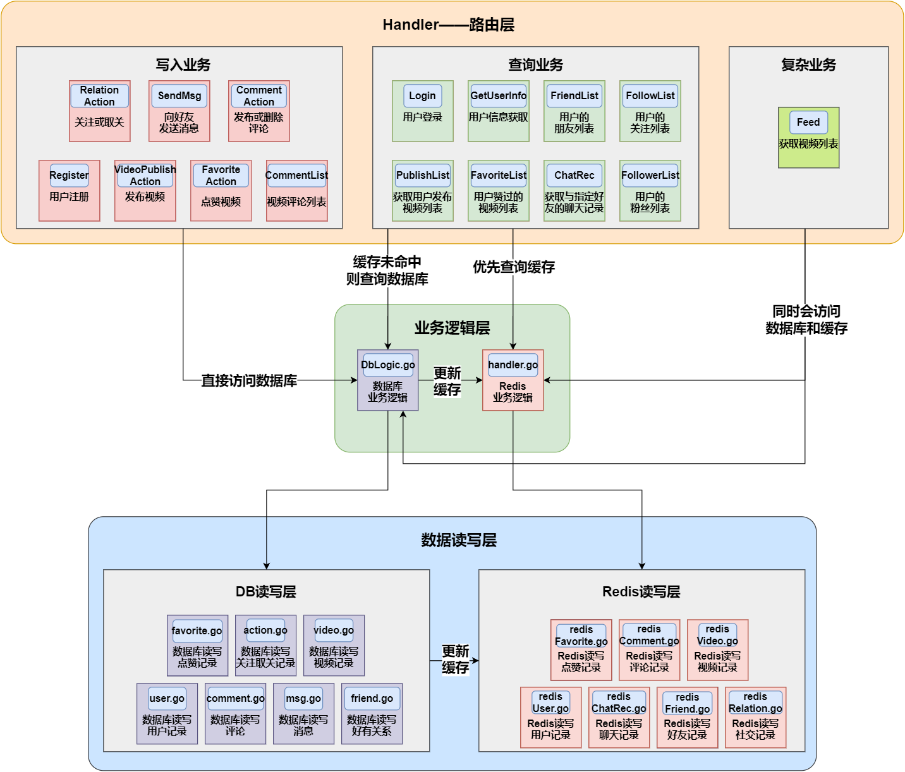
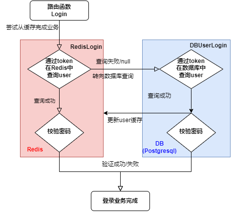
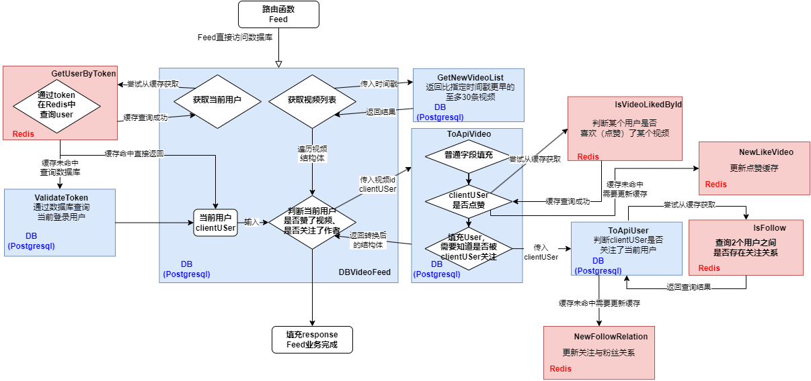
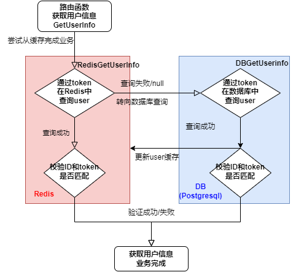
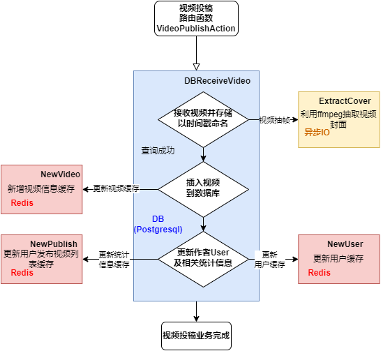

# miniDouyin

# 1 组织结构
```bash
├── biz # 除dal外，其余子文件夹由IDL生成
│   ├── dal # 数据库相关操作
│   │   ├── init.go 初始化数据库连接
│   │   ├── pg # 关系型数据库Postgresql连接和查询功能
│   │   │   ├── DbInterface.go
│   │   │   ├── DbLogic.go # 逻辑层，负责整体业务逻辑查询
│   │   │   ├── action.go # 点赞动作相关操作
│   │   │   ├── comment.go # 评论效相关操作
│   │   │   ├── defs.go # 接口定义，用于更新缓存的ipc通信
│   │   │   ├── favorite.go # 喜欢操作
│   │   │   ├── friend.go # 好有操作
│   │   │   ├── init.go # 初始化
│   │   │   ├── msg.go # 消息操作
│   │   │   ├── pgserver.go # 发送到chan更新缓存的服务器
│   │   │   ├── user.go # 用户操作
│   │   │   └── video.go # 视频操作
│   │   └── rdb
│   │       ├── handler.go # 缓存处理的业务逻辑
│   │       ├── init.go # 初始化Redis
│   │       ├── redisRelation.go # redis存储关系
│   │       ├── redisUser.go # redis存储user
│   │       └── redisVideo.go # redis存储视频
│   ├── handler
│   │   ├── miniDouyin
│   │   │   └── api
│   │   │       └── mini_douyin.go # 路由函数
│   │   └── ping.go
│   ├── model # 自动生成，定义接口数据结构等
│   └── router # 定义路由和中间件等
├── data # 静态文件：视频、头像、背景图
├── log # 日志管理
│   ├── hook.go # logrus库的hook
│   └── init.go # 初始化日志
├── main.go # 主函数
├── minidouyin.thrift # idl
├── router # 路由定义
│   ├── router.go # 路由注册
│   └── router_gen.go # 自定义路由
├── sql # 建表和插入测试数据的sql
├── test # 单元测试
└── utils
    ├── common.go # 普通功能函数
    ├── config.go # 配置文件
    ├── errors.go # 定义error
    ├── extractCover.go # 视频封面抽取
    └── messages.go # 预定义返回消息
```

# 2 组织架构
## 2.1 层级架构



如图所示为miniDouyin的层级架构，各个层级功能说明如下：

- 路由层
  负责与前端交互，主要完成参数绑定和任务派发的工作。任务派发可选择交付任务给Redis或数据库完成业务逻辑，具体视路由层业务类别而论：
  - 写入业务：写入业务由于会更新数据库，为保证一致性的需求，直接从数据库完成业务流程，写入内容会同步更新到缓存。
  - 查询业务：查询业务由于不会使得缓存失效，因此优先从缓存完成业务流程。缓存未命中时再从数据库完成业务流程，并同步更新到缓存。
  - 复杂业务：复杂业务会部分先后地同时查询缓存和数据库，因此需要仔细设计。本项目中只有获取视频列表属于复杂业务。该业务访问频率较低，因而可以视为缓存初始化和缓存更新的功能函数。
    
  路由层派发的任务将分配给业务逻辑层完成。

- 业务逻辑层
  业务逻辑层包括：
  - 数据库业务逻辑
  - Redis业务逻辑
  
  二者均能独立完成整个业务逻辑，但数据库业务逻辑完成后还会更新缓存。

  业务逻辑层将调用数据读写层的基础读写函数完成业务。

- 数据读写层
  数据读写层包括：
  - DB读写层
  - Redis读写层
  
  二者均完成基础的设计数据库表项的查询和写入操作。同时基础的写入操作完成时，DB读写层会更新Redis缓存。
  
## 2.2 业务流程
### 2.2.1 注册业务流程


注册业务过程如下：
- 校验用户名/邮箱是否已存在
- 插入数据
- 更新Redis中的user缓存

### 2.2.2 登录业务流程


登录业务逻辑很简单：
- 尝试从Redis缓存中获取完成整个登录流程，包括查询token查询和密码校验
- 如果缓存中不存在该key，则从数据库中查询，成功后需要更新Redis缓存

### 2.2.3 获取视频列表业务流程
首先说明，获取视频列表设计不会使用缓存完成整个业务，而是在局部利用缓存并更新缓存，理由如下：
- 视频列表的获取相对复杂，需要进行有条件的排序操作，还涉及时间戳格式的转换，单纯使用缓存难以完成整个业务
- 获取一个视频列表设计大量的表查询，因此可以利用该特性将该业务作为更新Redis缓存的一个功能函数
  


业务逻辑如下：
1. 获取client用户
   - client用户就是当前正在刷视频的人，可以尝试先通过缓存获取token对应的client用户
   - 缓存命中失败后，需要从数据库表中查询，并更新user缓存
2. 获取视频列表
   - 获取视频列表由数据库查videos表得到
   - 每一个和视频查到时需要更新video缓存（流程图由于太拥挤没有说明这一点）
3. 调用ToApiVideo进一步填充视频结构体的字段
   - 前端的视频结构体与后端数据库不一样，因为前端还要判断用户是否点赞了这个视频、是否关注了视频作者
   - client用户是否点赞了这个视频可以先查缓存得到，查询失败则再次查询数据库并更新缓存
   - 调用ToApiUser填充视频作者信息，ToApiUser会判断client用户是否关注了视频作者用户
   - ToApiUser中也会先查询缓存判断关注关系，缓存未命中则再次查询数据库并更新缓存

### 2.2.4 获取用户信息业务流程



获取用户信息业务逻辑很简单：
- 尝试从Redis缓存中获取完成整个业务流程，包括查询token查询和id校验
- 如果缓存中不存在该key，则从数据库中查询，成功后需要更新Redis缓存

### 2.2.5 视频投稿业务



视频投稿业务由于是对数据库的写入，所以不会从缓存来完成。

业务逻辑如下：
1. 接受并存储视频，视频名为避免重复以时间戳命名。
2. 将视频插入到数据库，并更新缓存。
3. 由于视频的插入，其作者和相关统计信息页发生了改变，需要更新其对应数据库和缓存。
4. 前端为提供视频封面图片，因此采用ffmpeg进行抽帧作为封面。由于需要进行系统调用，因此将次开销较大的部分作为异步执行。
5. 封面图和相关资源文件的命名格式见前文说明。

# 3 Redis缓存设计
## 3.1 Redis缓存设计思路
1. 对于简单的业务，每次尝试从缓存完成整个业务
2. 对于复杂的业务，其局部的查询可以借助缓存完成
3. 每次从数据库进行查找时，将查找内容更新到缓存
4. 每次写入数据库时，将新写入的内容更新到缓存 
5. 缓存使用过期时间完成替换，不进行额外的缓存替换策略设计

## 3.2 缓存内容
缓存内容主要有2大部分
1. 将数据库表描述的结构体以Hash的形式存储于Redis
2. 将数据库中的一对多关系以Set的形式存储于Redis，例如：某用户关注的用户的集合、某视频的评论集合。这种Set中存储的是其在Redis中的key（key通常和底层数据库的主键同名）

## 3.3 缓存类型和key命名约定
### 3.3.1 user缓存
该缓存描述了数据库的users表，是hash类型。

user缓存支持同时用`token`和`id`作为key值查找，例如`toni123456`和`4`都是某用户的key值
### 3.3.2 视频缓存
该缓存描述了数据库的videos表，是hash类型。

视频缓存的key格式为：前缀`video_` + `id`，如主键为27的视频在Redis缓存的key 为`video_27`
### 3.3.3 视频发布列表缓存
该缓存描述了用户发布的视频列表，是set类型，就是说从该缓存拿到值后需要从视频缓存或视频数据库中再次查询。

视频发布列表key格式为：前缀`publish_` + `id`，如主键为4的用户发布的视频列表在Redis缓存的key 为`publish_4`
### 3.3.4 关注列表缓存
该缓存描述了用户关注的其他用户的列表，是set类型，就是说从该缓存拿到值后需要从用户缓存或用户数据库中再次查询。

关注列表key格式为：前缀`follows_` + `token`，如token为`toni123456`的用户关注的其他用户的列表在Redis缓存的key 为`follows_toni123456`

### 3.3.5 喜欢列表缓存
该缓存描述了用户点赞的视频列表，是 set 类型，从缓存拿到值后需要从视频缓存或视频数据库中再次查询。

喜欢列表key格式为：前缀`user_like_` + `uid`。如主键为 4 的用户的喜欢列表在缓存中的 key 为`user_like_4`

### 3.3.6 粉丝列表缓存
该缓存描述了其他用户关注用户的粉丝列表，是 set 类型，从该缓存拿到值后需要从用户缓存或用户数据库中再次查询。

粉丝列表key格式为：前缀`followers_` + uid。


### 3.3.7 评论缓存
该缓存描述了数据库的 comment 表，类型为 hash，将结构体的评论表转为map存储在Redis缓存。

key格式为：前缀`comment_` + `comment_id`

另外，获取某视频的评论列表时，需要先从视频缓存中获取视频的评论列表，然后再从评论缓存中获取评论的内容。

所以设计了一个视频评论列表缓存，类型为 zset，key格式为：前缀`video_comment_` + `vid`


### 3.3.8 消息缓存
类型为hash，将结构体的消息表转为map存储在Redis缓存。

key格式为：前缀`msg_` + `id`

### 3.3.9 通信缓存
key设计：前缀`msgRecord_` + `id(较小）` + `_` +  `id(较大）`

类型是zset，按照消息id排序

存储的内容就是message的主键`id`, 就是说从该缓存拿到值后需要从消息缓存中再次查询。

PS:应用业务：
> 查询2个人的消息记录，直接查这个通信缓存，拿到id后再去消息缓存里面拿到消息

### 3.3.10 好友列表缓存
类型Set，涩图里面存储的就是好友的id

PS：好友列表的业务流程；
>好友 = user缓存 + 其余填充字段。
>好友列表是Set，set里面存的是好友的id
>通过好友id就可以到user缓存里面查到好友的user表示的map
>需要通过好友与自己通信的缓存中获取最新的消息记录，然后填充剩余字段

